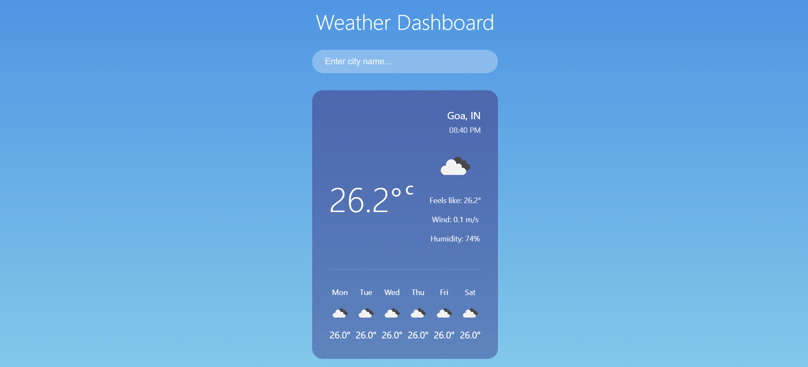

# React Weather Dashboard

A modern weather dashboard built with React that displays current weather conditions and forecasts. The application uses the OpenWeatherMap API to fetch real-time weather data and updates automatically every 30 seconds.



## Features

- 🔍 Search for any city worldwide
- 🌡️ Real-time weather data updates
- 🔄 Auto-refresh every 30 seconds
- 📱 Responsive design
- 🌍 Temperature unit conversion (Celsius/Fahrenheit)
- 💾 Saves last searched city
- 🎨 Modern UI with blur effects and gradients
- 📅 Weekly forecast display
- 🌪️ Detailed weather information (temperature, humidity, wind speed)

## Technologies Used

- React.js
- Context API for state management
- CSS Modules for styling
- OpenWeatherMap API
- Modern JavaScript (ES6+)

## Getting Started

### Prerequisites

- Node.js (v14 or higher)
- npm or yarn

### Installation

1. Clone the repository:
```bash
git clone https://github.com/yourusername/react-weather-dashboard.git
```
    
2. Navigate to the project directory:
```bash
cd react-weather-dashboard
```

3. Install dependencies:
```bash
npm install
```

4. Create a `.env` file in the root directory and add your OpenWeatherMap API key:
```
VITE_WEATHER_API_KEY=your_api_key_here
```

5. Start the development server:
```bash
npm run dev
```

The application will start running at `http://localhost:5173`

### Building for Production

To create a production build:

```bash
npm run build
```

## Usage

1. Enter a city name in the search bar
2. Press Enter or click the search button
3. View current weather conditions and forecast
4. Click the temperature unit (C/F) to toggle between Celsius and Fahrenheit
5. The weather data will automatically update every 30 seconds

## Project Structure

```
src/
├── components/
│   ├── SearchBar/
│   ├── WeatherDisplay/
│   └── ErrorMessage/
├── context/
│   └── WeatherContext.jsx
├── App.jsx
└── main.jsx
```

## API Reference

This project uses the OpenWeatherMap API. You'll need to sign up for a free API key at [OpenWeatherMap](https://openweathermap.org/api).

API Endpoints used:
- Current Weather: `api.openweathermap.org/data/2.5/weather`
- 5-day Forecast: `api.openweathermap.org/data/2.5/forecast`

## Contributing

1. Fork the repository
2. Create your feature branch (`git checkout -b feature/AmazingFeature`)
3. Commit your changes (`git commit -m 'Add some AmazingFeature'`)
4. Push to the branch (`git push origin feature/AmazingFeature`)
5. Open a Pull Request

## License

This project is licensed under the MIT License - see the [LICENSE](LICENSE) file for details.

## Acknowledgments

- Weather data provided by [OpenWeatherMap](https://openweathermap.org/)
- Icons from OpenWeatherMap's weather icon set
- Built with [Vite](https://vitejs.dev/)

## Contact

Your Name - [@yourtwitter](https://twitter.com/yourtwitter)

Project Link: [https://github.com/yourusername/react-weather-dashboard](https://github.com/yourusername/react-weather-dashboard)

